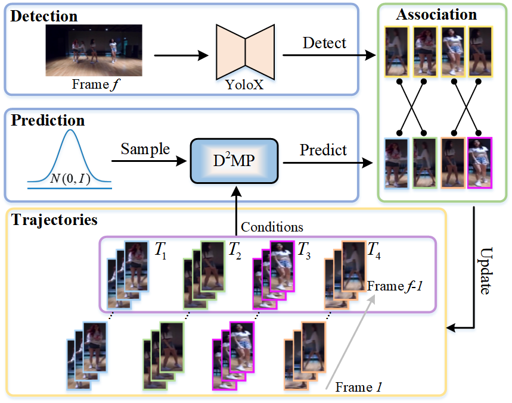
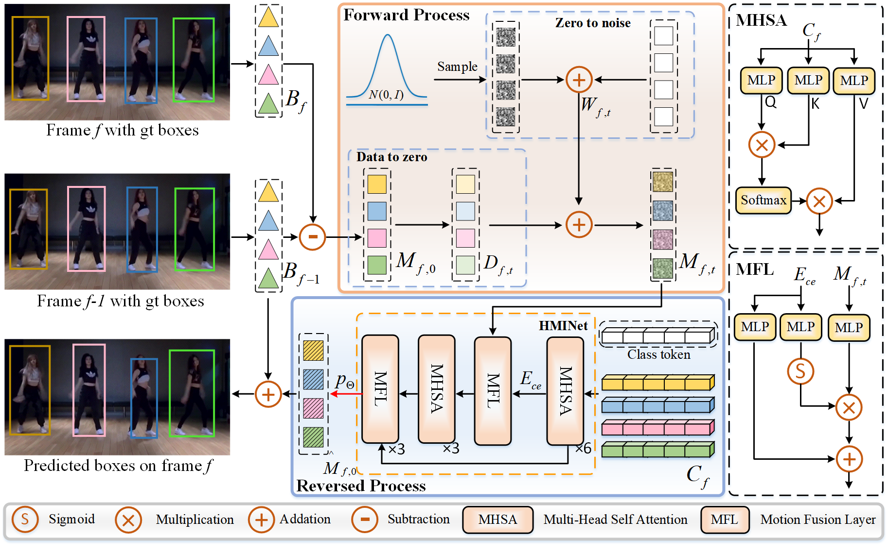

# DiffMOT (CVPR2024)
## DiffMOT: A Real-time Diffusion-based Multiple Object Tracker with Non-linear Prediction
[](https://diffmot.github.io/)
[](https://arxiv.org/abs/2403.02075)


## Framework



# News
- 2024-02-27: This work is accepted by **CVPR-2024**.

## Tracking performance
### Benchmark Evaluation
| Dataset    |  HOTA | IDF1 | Assa | MOTA | DetA | Results |
|--------------|-----------|--------|-------|----------|----------|----------|
|DanceTrack  | 63.4 | 64.0 | 48.8 | 92.7 | 82.5 |[DanceTrack_Results](https://github.com/Kroery/DiffMOT/releases/download/v1.2/DanceTrack_DiffMOT.zip)|
|SportsMOT   | 76.2 | 76.1 | 65.1 | 97.1 | 89.3 |[SportsMOT_Results](https://github.com/Kroery/DiffMOT/releases/download/v1.2/SportsMOT_DiffMOT.zip)|
|MOT17       | 64.5 | 79.3 | 64.6 | 79.8 | 64.7 |[MOT17_Results](https://github.com/Kroery/DiffMOT/releases/download/v1.2/MOT17_DiffMOT.zip)|
|MOT20       | 61.7 | 74.9 | 60.5 | 76.7 | 63.2 |[MOT20_Results](https://github.com/Kroery/DiffMOT/releases/download/v1.2/MOT20_DiffMOT.zip)|

### Results on DanceTrack test set with different detector
| Detector    |  HOTA | IDF1 | MOTA | FPS |
|--------------|-----------|--------|-------|----------|
|YOLOX-S  | 53.3 | 56.6 | 88.4 | 30.3 |
|YOLOX-M  | 57.2 | 58.6 | 91.2 | 25.4 |
|YOLOX-L  | 61.5 | 61.7 | 92.0 | 24.2 |
|YOLOX-X  | 63.4 | 64.0 | 92.7 | 22.7 |

The tracking speed (including detection and tracking speed) is test on an RTX 3090 GPU. Smaller detectors can achieve higher FPS, which indicates that DiffMOT can flexibly choose different detectors for various real-world application scenarios. With YOLOX-S, the tracking speed of the entire system can reach up to **30.3 FPS**.

### Video demos
   

## I. Installation.
* install torch
~~~
conda create -n diffmot python=3.9
conda activate diffmot
pip install torch==2.0.1 torchvision==0.15.2 torchaudio==2.0.2
~~~
* install other packages.
~~~
pip install -r requirement.txt
~~~
* install external dependencies.
~~~
cd external/YOLOX/
pip install -r requirements.txt && python setup.py develop
cd ../external/deep-person-reid/
pip install -r requirements.txt && python setup.py develop
cd ../external/fast_reid/
pip install -r docs/requirements.txt
~~~

## II. Prepare Data.
The file structure should look like:  
* **DanceTrack**
~~~
{DanceTrack ROOT}
|-- dancetrack
|   |-- train
|   |   |-- dancetrack0001
|   |   |   |-- img1
|   |   |   |   |-- 00000001.jpg
|   |   |   |   |-- ...
|   |   |   |-- gt
|   |   |   |   |-- gt.txt            
|   |   |   |-- seqinfo.ini
|   |   |-- ...
|   |-- val
|   |   |-- ...
|   |-- test
|   |   |-- ...
~~~
* **SportsMOT**
~~~
{SportsMOT ROOT}
|-- sportsmot
|   |-- splits_txt
|   |-- scripts
|   |-- dataset
|   |   |-- train
|   |   |   |-- v_1LwtoLPw2TU_c006
|   |   |   |   |-- img1
|   |   |   |   |   |-- 000001.jpg
|   |   |   |   |   |-- ...
|   |   |   |   |-- gt
|   |   |   |   |   |-- gt.txt
|   |   |   |   |-- seqinfo.ini         
|   |   |   |-- ...
|   |   |-- val
|   |   |   |-- ...
|   |   |-- test
|   |   |   |-- ...
~~~
* **MOT17/20** We train the MOT17 and MOT20 together.
~~~
{MOT17/20 ROOT}
|-- mot
|   |-- train
|   |   |-- MOT17-02
|   |   |   |-- img1
|   |   |   |   |-- 000001.jpg
|   |   |   |   |-- ...
|   |   |   |-- gt
|   |   |   |   |-- gt.txt            
|   |   |   |-- seqinfo.ini
|   |   |-- ...
|   |   |-- MOT20-01
|   |   |   |-- img1
|   |   |   |   |-- 000001.jpg
|   |   |   |   |-- ...
|   |   |   |-- gt
|   |   |   |   |-- gt.txt            
|   |   |   |-- seqinfo.ini
|   |   |-- ...
|   |-- test
|   |   |-- ...
~~~

and run:

```
python dancetrack_data_process.py
python sports_data_process.py
python mot_data_process.py
```

## III. Model ZOO.
### Detection Model
We provide some trained YOLOX weights in [download](https://github.com/Kroery/DiffMOT/releases/tag/v1.0) for DiffMOT. Some of them are inherited from [ByteTrack](https://github.com/ifzhang/ByteTrack#model-zoo), [DanceTrack](https://github.com/DanceTrack/DanceTrack#evaluation), and [MixSort](https://github.com/MCG-NJU/MixSort#model-zoo).

### ReID Model
Ours ReID models for **MOT17/MOT20** is the same as [BoT-SORT](https://github.com/NirAharon/BOT-SORT) , you can download from [MOT17-SBS-S50](https://github.com/Kroery/DiffMOT/releases/download/v1.0/mot17_sbs_S50.pth), [MOT20-SBS-S50](https://github.com/Kroery/DiffMOT/releases/download/v1.0/mot20_sbs_S50.pth). The ReID model for **DanceTrack** is the same as [Deep-OC-SORT](https://github.com/GerardMaggiolino/Deep-OC-SORT), you can download from [Dance-SBS-S50](https://github.com/Kroery/DiffMOT/releases/download/v1.0/dance_sbs_S50.pth). The ReID model for **SportsMOT** is trained by ourself, you can download from [Sports-SBS-S50](https://github.com/Kroery/DiffMOT/releases/download/v1.0/sports_sbs_S50.pth).

**Notes**:


* [MOT20-SBS-S50](https://drive.google.com/drive/folders/18IsZGeGiyKDshhYIzbpYXoNEcBhPY8lN?usp=sharing) is trained by [Deep-OC-SORT](https://github.com/GerardMaggiolino/Deep-OC-SORT), because the weight from BOT-SORT is corrupted. Refer to [Issue](https://github.com/GerardMaggiolino/Deep-OC-SORT/issues/6).
* ReID models for SportsMOT is trained by ourself.


### Motion Model (D$^2$MP)
coming soon.

## IV. Training.
### Train the detection model
* You can refer to the [ByteTrack](https://github.com/ifzhang/ByteTrack#training).

### Train the ReID model
* You can refer to the [BoT-SORT](https://github.com/NirAharon/BoT-SORT#train-the-reid-module).


### Train the motion model (D$^2$MP)
* Change the data_dir in config
* Train on DanceTrack, SportsMOT, and MOT17/20:
```
python main.py --config ./configs/dancetrack.yaml
python main.py --config ./configs/sportsmot.yaml
python main.py --config ./configs/mot.yaml
```

## V. Tracking.
### Prepare detections
* You can obtain the detections by [detection_model](https://github.com/Kroery/DiffMOT#detection-model) or use the [detection_results](https://github.com/Kroery/DiffMOT/releases/download/v1.1/Detections.zip) we have provided.
* Change the det_dir in config.

### Prepare ReID embeddings
* We have provided the [ReID embeddings](https://drive.google.com/drive/folders/1mScXsSgq_t7Y4AakPMhwrQ8Lu0vbGj1Z?usp=sharing).
* Change the reid_dir in config.

### Track on DanceTrack
* Change the info_dir, and save_dir in config.
* High_thres is set to 0.6, low_thres is set to 0.4, w_assoc_emb is set to 2.2, and aw_param is set to 1.7.
```
python main.py --config ./configs/dancetrack_test.yaml
```

### Track on SportsMOT
* Change the info_dir, and save_dir in config.
* High_thres is set to 0.6, low_thres is set to 0.4, w_assoc_emb is set to 2.0, and aw_param is set to 1.2.
```
python main.py --config ./configs/sportsmot_test.yaml
```

### Track on MOT17
* Change the info_dir, and save_dir in config.
* High_thres is set to 0.6, low_thres is set to 0.1, w_assoc_emb is set to 2.2, and aw_param is set to 1.7.
```
python main.py --config ./configs/mot17_test.yaml
```

### Track on MOT20
* Change the info_dir, and save_dir in config.
* High_thres is set to 0.4, low_thres is set to 0.1, w_assoc_emb is set to 2.2, and aw_param is set to 1.7.
```
python main.py --config ./configs/mot20_test.yaml
```

## Contact
If you have some questions, please concat with kroery@shu.edu.cn.

## Acknowledgement
A large part of the code is borrowed from [DDM-Public](https://github.com/GuHuangAI/DDM-Public) and [Deep-OC-SORT](https://github.com/GerardMaggiolino/Deep-OC-SORT). Thanks for their wonderful works.

## Citation
~~~
@article{lv2024diffmot,
  title={DiffMOT: A Real-time Diffusion-based Multiple Object Tracker with Non-linear Prediction},
  author={Lv, Weiyi and Huang, Yuhang and Zhang, Ning and Lin, Ruei-Sung and Han, Mei and Zeng, Dan},
  journal={arXiv preprint arXiv:2403.02075},
  year={2024}
}
~~~


